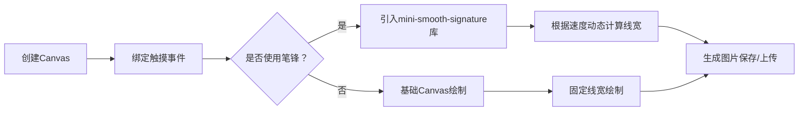

在微信小程序中实现手写签名功能，核心是通过 Canvas 组件捕获用户触摸轨迹并实时绘制线条。以下是具体实现方案和优化建议，结合基础实现与高级效果（如笔锋）分步说明：

---

### 一、基础实现步骤
1. **创建 Canvas 画布**  
   在 WXML 中添加 Canvas 组件，禁用页面滚动防止干扰：
   ```wxml
   <canvas 
     canvas-id="signatureCanvas" 
     style="width:100%; height:300px; background:#fff;"
     disable-scroll="true"
     bindtouchstart="handleTouchStart"
     bindtouchmove="handleTouchMove"
     bindtouchend="handleTouchEnd"
   ></canvas>
   <button bindtap="clearCanvas">清空</button>
   <button bindtap="saveSignature">保存</button>
   ```

2. **初始化画布上下文**  
   在 JS 中获取 Canvas 上下文，设置画笔样式：
   ```javascript
   Page({
     data: { canvasCtx: null },
     onReady() {
       const ctx = wx.createCanvasContext('signatureCanvas');
       ctx.setStrokeStyle('#000000'); // 画笔颜色
       ctx.setLineWidth(3);          // 线宽
       ctx.setLineCap('round');      // 端点圆润
       ctx.setLineJoin('round');     // 连接点圆滑
       this.setData({ canvasCtx: ctx });
     },
     // 后续事件处理...
   });
   ```

3. **处理触摸事件**  
   - **TouchStart**：记录起点，开始新路径  
     ```javascript
     handleTouchStart(e) {
       const { x, y } = e.touches[0];
       const ctx = this.data.canvasCtx;
       ctx.beginPath();
       ctx.moveTo(x, y);
     }
     ```
   - **TouchMove**：连线并实时绘制  
     ```javascript
     handleTouchMove(e) {
       const { x, y } = e.touches[0];
       const ctx = this.data.canvasCtx;
       ctx.lineTo(x, y);
       ctx.stroke();
       ctx.draw(true); // 立即渲染
     }
     ```
   - **TouchEnd**：闭合路径（可选）  
     ```javascript
     handleTouchEnd() {
       this.data.canvasCtx.closePath();
     }
     ```

4. **添加清除功能**  
   ```javascript
   clearCanvas() {
     const { canvasCtx } = this.data;
     const { windowWidth, windowHeight } = wx.getSystemInfoSync();
     canvasCtx.clearRect(0, 0, windowWidth, 300); // 高度需与画布一致
     canvasCtx.draw(true);
   }
   ```

5. **保存签名图片**  
   使用 `wx.canvasToTempFilePath` 生成临时图片路径：
   ```javascript
   saveSignature() {
     wx.canvasToTempFilePath({
       canvasId: 'signatureCanvas',
       success: (res) => {
         const tempFilePath = res.tempFilePath;
         // 保存到相册或上传服务器
         wx.saveImageToPhotosAlbum({ filePath: tempFilePath });
       },
       fail: (err) => console.error('保存失败', err)
     });
   }
   ```

---

### 二、进阶：实现笔锋效果
基础绘制线条粗细固定，而真实签名需根据书写速度动态变化（快速移动时线条变细，慢速时变粗）。推荐使用 **mini-smooth-signature** 库简化实现：  
1. **安装库**  
   ```bash
   npm install mini-smooth-signature
   ```

2. **初始化带笔锋的签名实例**  
   ```javascript
   import Signature from 'mini-smooth-signature';
   Page({
     onReady() {
       const ctx = wx.createCanvasContext('signatureCanvas');
       this.signature = new Signature(ctx, {
         width: 300,   // 画布实际宽度
         height: 200,  // 画布实际高度
         minWidth: 2,  // 最小线宽（笔锋细处）
         maxWidth: 8,  // 最大线宽（笔锋粗处）
         color: '#000',
         openSmooth: true // 开启笔锋
       });
     },
     handleTouchMove(e) {
       const { x, y } = e.touches[0];
       this.signature.onDrawMove(x, y); // 库自动计算线宽并绘制
     }
   });
   ```

---

### 三、关键优化技巧
1. **横屏适配**  
   - 在页面 JSON 中设置 `"pageOrientation": "landscape"`。  
   - 通过 `wx.getSystemInfoSync()` 动态获取屏幕宽高，调整 Canvas 尺寸。

2. **性能与体验优化**  
   - **防锯齿**：Canvas 宽高设为样式宽高的 2 倍（Retina 屏适配）：
     ```javascript
     const ratio = wx.getSystemInfoSync().pixelRatio;
     canvas.width = canvasWidth * ratio;
     canvas.height = canvasHeight * ratio;
     ctx.scale(ratio, ratio);
     ```
   - **绘制卡顿**：使用 `requestAnimationFrame` 替代高频 `draw()`。

3. **多平台兼容**  
   - 微信/支付宝/钉钉小程序均可使用 `mini-smooth-signature`。  
   - 注意：新版 Canvas 2D 在滑动时可能出现坐标偏移，建议测试真机效果或使用旧版 API。

4. **数据安全**  
   - 敏感场景需对签名图片加密（如 `wx.encrypt`）或直传服务器，避免本地存储泄露风险。

---

### 四、完整流程示意图


> 💡 **提示**：若需完整代码示例，可参考 [mini-smooth-signature 官方示例](https://www.npmjs.com/package/mini-smooth-signature) 或微信社区横屏签名实现。